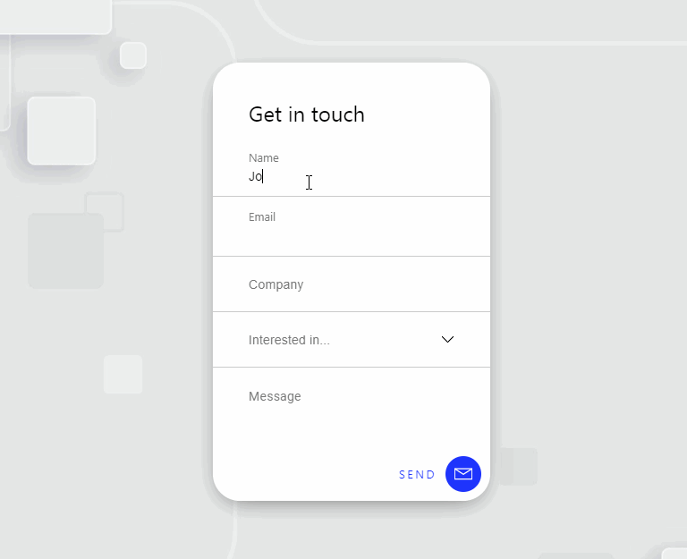

# Floating Form

A little react project to create a form design with some
little functionalities. I created a component for the
drop-down list and used a flip card effect with css when
the form gets submitted. For the style of the form i used
modules.

For the form I used the design from Matthieu Souteyrand
[https://dribbble.com/shots/4204704-Floating-contact-form]

The background image is from [https://www.freepik.com] and made by the author **coolvector**

The Icons used for the project are from [https://freeicons.io] and the authors are the following:

* mail icon by [Anu Rocks](https://freeicons.io/profile/730)
* arrow icon by [icon king1](https://freeicons.io/profile/3)
* arrow bottom icon by [freeicons](https://freeicons.io/profile/3)